# 引言

UICollectionView在iOS中是构建复杂布局的强大工具。iOS13中引入的UICollectionView Compositional Layout为创建自定义布局提供了全新的可能性。本文将深入探讨Compositional Layout的工作原理,以及如何利用它创建复杂的分组、嵌套布局和增强视图。无论您是刚开始学习Compositional Layout,还是想掌握它的高级用法,本文都将是您的完美指南。让我们开始这个令人兴奋的布局之旅吧!

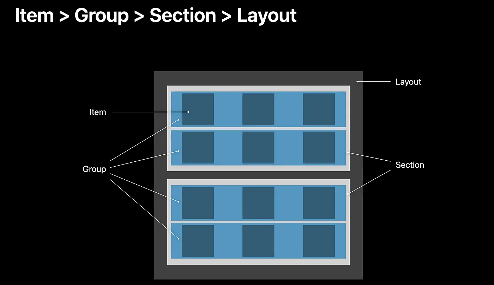

CollectionView Layout由三个布局部分组成

## Item
- 它是层次结构中的最小单元，代表您想要在屏幕上显示的单个数据块
- Item展示在Cell内部

## Group
- Item位于Group内
- Group可以将其Item按水平行、垂直列或自定义排列。
- Group是布局的基本单位，Group指定数据布局的方向并且可以组合在一起创建更复杂的布局

## Section
- Section只是一组数据，对应于数据在数据源中的组织方式
- **Collection View可以有多个Section，每个Section包含自己的Group和Item**

在iOS 6中，包含UICollectionView的API可以被划分为三个不同的类别——Data、Layout和Presentation。这种区别是UICollectionView如此灵活的核心。当UICollectionView在iOS 6中首次发布时，数据是通过基于索引路径的协议UICollectionViewDataSource来管理的。对于布局，有一个抽象类`UICollectionViewLayout`，一个具体的子类`UICollectionViewFlowLayout`。在视图展示方面，有两种视图类型`UICollectionViewCell`和`UICollectionReusableView`。

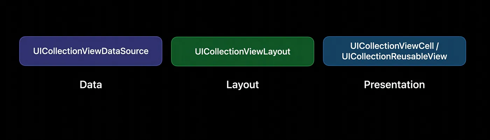

​																												图1

**在iOS 13中，苹果分别为数据Data和布局Layout引入了两个新的组件，分别是Diffable Data Source和Compositional Layout。这些API现在用于使用UICollectionViews构建应用程序。**

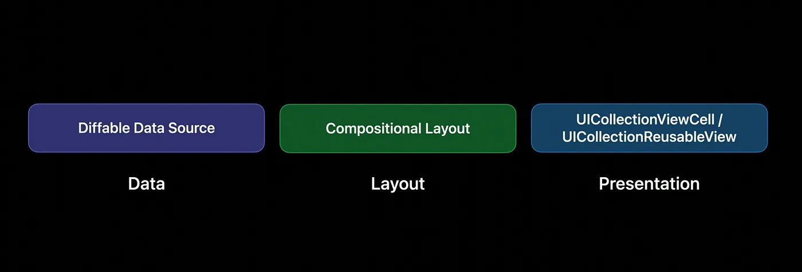

​																												图2

#  创建Compositional Layout

>  完整示例见代码-[CompositionalLayout1](https://github.com/kingnight/UICollectionCompositionalLayout/)

## 布局关系

先来看一个布局实例

```swift
    func configLayout() -> UICollectionViewLayout {
		//Group width = 1.0，super view是section，section parent是collectionview layout所以它会占据整个屏幕的宽度，height = 0.2 *它的super view的宽度也是section
        let itemSize = NSCollectionLayoutSize(widthDimension: .fractionalWidth(0.2), heightDimension: .fractionalHeight(1.0))
        let item = NSCollectionLayoutItem(layoutSize: itemSize)
        
        let groupSize = NSCollectionLayoutSize(widthDimension: .fractionalWidth(1.0), heightDimension: .fractionalWidth(0.2))
        let group = NSCollectionLayoutGroup.horizontal(layoutSize: groupSize, subitems: [item])
        
        let section = NSCollectionLayoutSection(group: group)
        let layout = UICollectionViewCompositionalLayout(section: section)
        return layout
    }
```

接下来介绍每一部分内容

## Item

- 这些Item不代表实际项目，可以把它看作是提供实际数据时使用的蓝图，它存储了UICollectionViewCell的布局信息
- NSCollectionLayoutSize允许我们定义宽度和高度作为NSCollectionLayoutDimension的一个实例
- 创建Item顺序：Item → NSCollectionLayoutItem → NSCollectionLayoutSize → NSCollectionLayoutDimension

### [NSCollectionLayoutDimension](https://developer.apple.com/documentation/uikit/nscollectionlayoutdimension)

- 集合视图中的每个元素都有一个显式的宽度维度和高度维度，它们组合起来定义了元素的大小(NSCollectionLayoutSize)。
- **可以使用绝对值、估计值或小数来表示Item的尺寸**。
- 使用绝对值来指定精确的尺寸，比如44 x 44的点正方形:
```swift
let absoluteSize = NSCollectionLayoutSize(widthDimension: .absolute(44),
                                         heightDimension: .absolute(44))
```

如果内容的大小可能在运行时发生变化，例如在加载数据或响应系统字体大小的变化时，请使用估定值。您提供一个初始估计大小，系统稍后计算实际值。
```swift
let estimatedSize = NSCollectionLayoutSize(widthDimension: .estimated(200),
                                          heightDimension: .estimated(100))
```

使用一个小数来定义一个相对于Item容器尺寸的值。此选项简化了指定长宽比。例如，下面的元素的宽度和高度都等于其容器宽度的20%，从而创建了一个随容器大小变化而变大或缩小的正方形。

```swift
let fractionalSize = NSCollectionLayoutSize(widthDimension: .fractionalWidth(0.2),
                                           heightDimension: .fractionalWidth(0.2))
```

## Groups

- Groups是NSCollectionLayoutGroup的实例，必须指定布局方向（水平/垂直），才能明确滚动方向、大小和它包含的Item，我们将在后面讨论subitems: [item])
- 在上面例子中，Group表示行（NSCollectionLayoutGroup.horizontal），每个Group或row包含5个项目，Group的高度等于单个元素的宽度
- **Group是组合布局的基本单位。有三种形式：水平，垂直和自定义，水平或垂直是两种基本形式，还可以自定义Group，允许你以自定义方式指定Item的绝对大小和位置，** 自定义Group稍后详细介绍

## Section

- 集合视图布局有一个或多个Section。section提供了一种将布局分成不同部分的方法。
- 每个Section可以与集合视图中的其他部分具有相同的布局，也可以具有不同的布局。section的布局是由用来创建section的组(NSCollectionLayoutGroup)的属性决定的。
- 每个Section可以有自己的背景、页眉和页脚，以区别于其他部分。
- Section是NSCollectionLayoutSection的一个实例，我们在这个Section下指定group，最后创建UICollectionViewCompositionalLayout传入前面创建的Section。

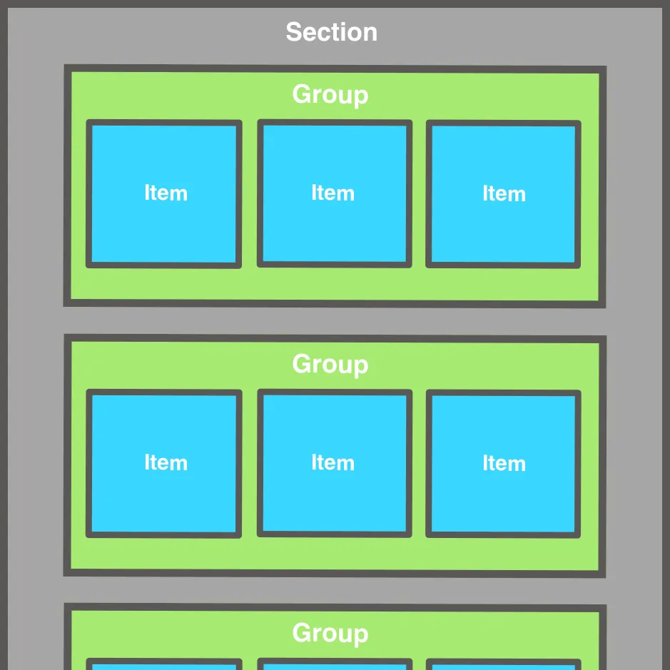

​																												图3

## Item Size 计算

假设集合视图，屏幕宽度= 428，计算item size
- 默认情况下，section会填满整个屏幕宽度，因为集合视图CollectionView的宽度占据了整个屏幕宽度

- 对于section的高度，section依赖于嵌套容器来通知它的大小

- Section包含多个Group；Group宽度是相同的，所以Group宽度将是428；Group高= 0.2 * Section宽度 = 85.7

- item宽度= 0.2 * Group的宽度= 85.7；Item 高度 = 1.0 Group高度 = 85.7

显示结果如下图4所示

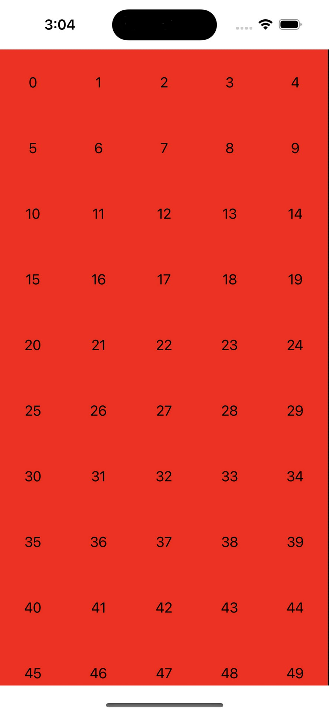

​																												图4

## 配置DataSource

- CollectionView没有组织和管理底层数据。这是数据源对象DataSource的职责
- Datasource管理数据、为CollectionView提供要显示的数据快照snapshot
- 我们从初始快照开始，快照被认为是**当前UI状态的真相truth of the current UI state**(这个非常重要)
- 我们向数据源提供初始快照以及关于如何处理数据的指令，它将处理其余的事情

### DiffableDataSource

- 数据源可以自动计算出两个快照之间的差异，而不是简单地用新数据填充集合视图，它可以告诉集合视图如何移动现有数据，以我们想要的方式显示它，因为数据源可以在两个快照之间有所不同，所以它被称为diffable数据源
- Diffable数据源是一种声明式的方法来处理底层数据(而不是告诉数据源如何使用声明式方法移动数据，我们只是简单地告诉数据源数据的新状态是什么)。数据源自动地完成工作，找出旧状态和新状态之间的区别，以及如何在集合视图中应用这些更改
- diffable数据源被定义为UICollectionViewDiffableDataSource类的实例。在创建实例时，您指定它将包含什么类型的数据以及如何填充单元格的说明；UICollectionViewDiffableDataSource是一个泛型类，它接受两个参数Section type和Item type，如图6所示。SectionIdentifierType和ItemIdentifierType都有一个约束，即它们都需要符合Hashable，这些类型提供的哈希作为数据源的唯一标识符。这非常有用，在实践中几乎任何对象都可以用来表示Section或Item

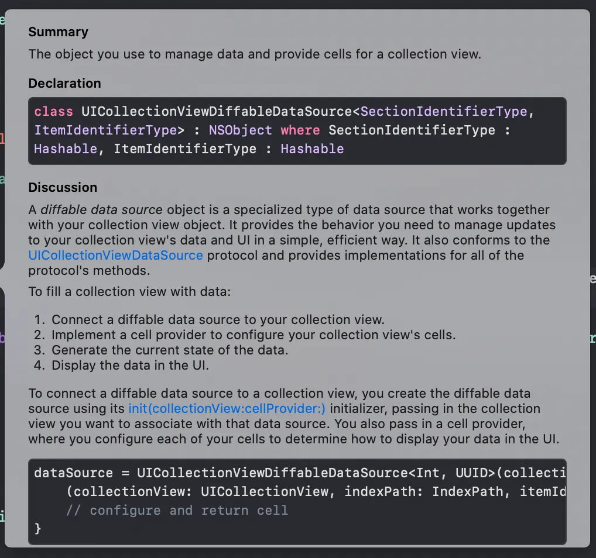

​																												图5

### 创建快照(SnapShot)应用于DataSource

- SnapShot是NSDiffableDataSourceSnapshot实例，它是一个泛型类型，有两个参数，一个定义Section，另一个定义Item，例如`var snapshot = NSDiffableDataSourceSnapshot<Section, Int>()`
- Snapshot根据Section定义其数据，其中Section包含一系列Item
- 创建快照，首先要使用appendSections方法添加一个section，这个方法接受一个section的数组，该数组与数据源和快照类型定义中指定的类型匹配，因为我们只有一个section，你可以提供枚举值.main作为参数
- 接下来需要向这个使用了`snapshot.appendSections(_ identifiers: [SectionIdentifierType])`方法的区域中添加Item，为每个会话指定Item，因为我们只有一个Scetion，所以无需指定；
- 现在我们指定需要应用到datasource的初始快照，因为我们首先加载整个数据。animatingDifferences(BOOL)
- apply的意思是日期源遍历数据并传递每个数字，以及集合视图和每个单元格的indexpath到我们刚刚定义的闭包中

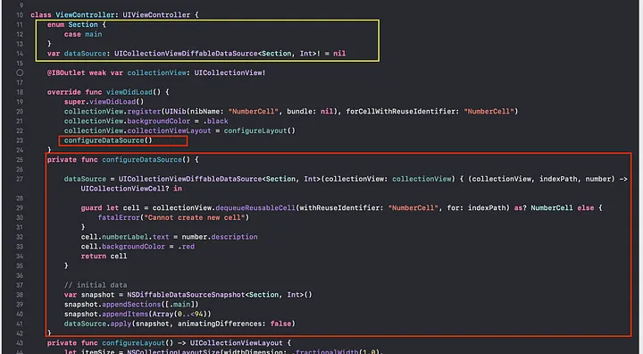

​																												图6

## Spacing


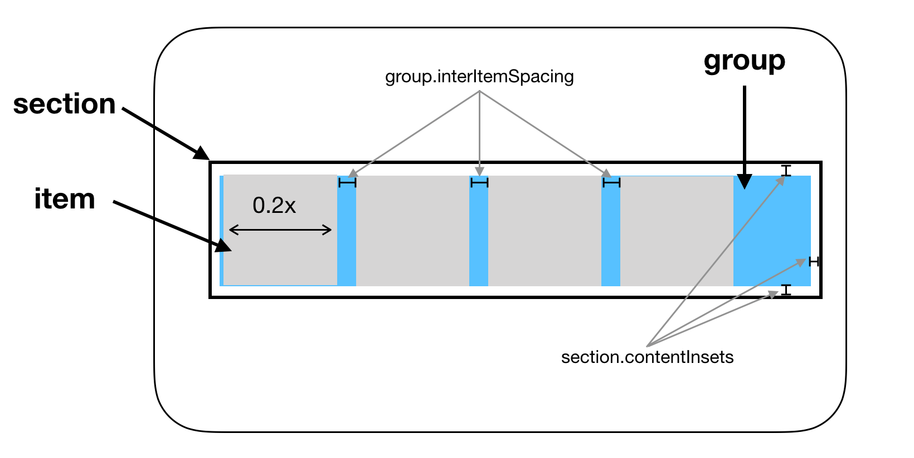

​																														图7

间距是在设计页面时必要的设置，以创建清晰优美的UI。

在组合布局中，有二个层次的间距可以设置

* Item的间距，通过`group.interItemSpacing`，其中interItemSpacing的类型是NSCollectionLayoutSpacing
  * NSCollectionLayoutSpacing→一个定义集合视图中元素之间或元素周围空间的对象。在集合视图布局中，你可以使用spacing对象来指定空间大小和计算空间大小的方式。可以使用`fixed`或`flexible`的间距来表示间距。
    * 使用`fixed`间距来提供精确数量的空间。例如，下面的代码在组中的项之间创建10个点的间距。
    * 使用`flexible`间距来提供最小的间距，可以随着更多空间的可用性而增长。例如，下面的代码在组中的项之间创建至少10个点的空间。当有更多可用空间时，Item会在额外空间中均匀分布。
* group间距，通过`section.interGroupSpacing`设置浮点数

* 此外，还可以对Item，group，section均可设置contentInsets，**NSDirectionalEdgeInsets**→视图的内嵌距离，考虑到用户界面布局方向。

接下来，通过代码示例，展示一下这些参数如何设置，首先调整item的宽度占满整个屏幕，类似UITableViewCell布局

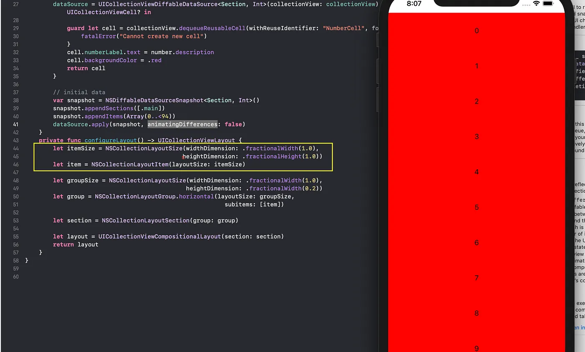

​																											图8

下面图9所示部分，使用interGroupSpacing设置section之间的空间大小，目前每一行是一个Group，每个Group里有一个Item

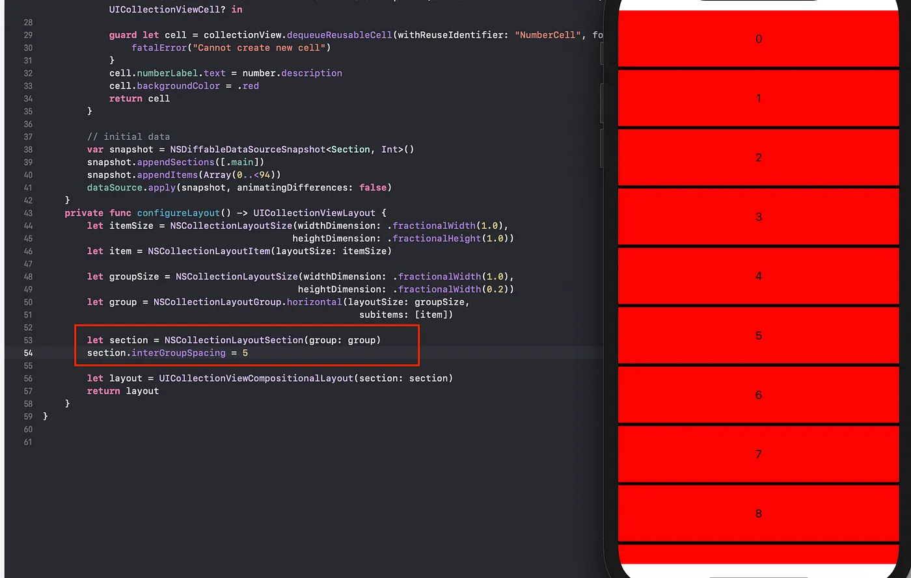

​																										图9

如图10所示，设置section的contentInsets，改变section内容与其边界之间的空间大小。

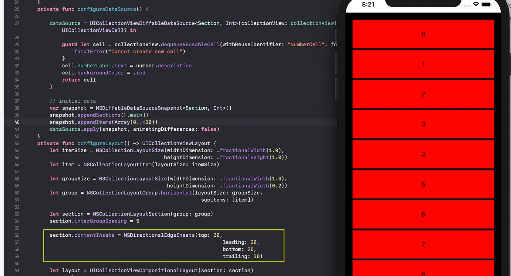

​																											图10

**group.contentInsets** 计算出元素的位置后，元素内容周围用于调整最终大小的空间大小。内容嵌入到组中每个项目的每个边缘。所以你现在可以想我们可以有很多变化来添加边内距

我们也可以在Item级别上指定，注意顺序很重要，如图所示，我们在创建group后指定项目内容内嵌，在这种情况下，它将不起作用（对比图11 vs 12）

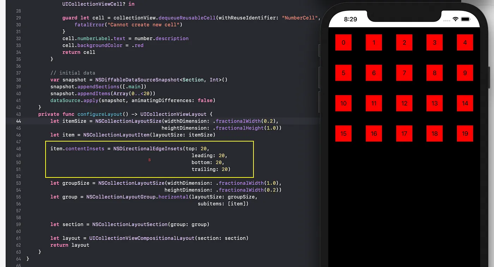

​																											图11

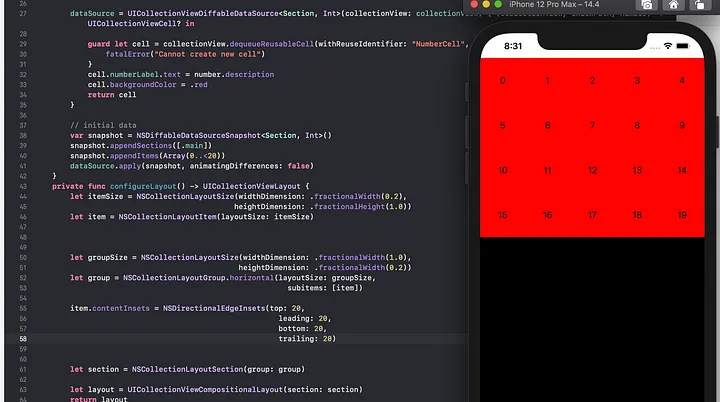

​																											图12

在图13中可以看到，我们创建了基于两列的布局。你应该看到的新东西是我们正在构建组，它以稍微不同的方式表示每一行。**我们使用了另一种形式的初始化器，它接受显式的count参数，这里我们显式地指定了每组或每行只有两个元素。**现在，这导致组合布局自动计算出元素的宽度必须是多少。

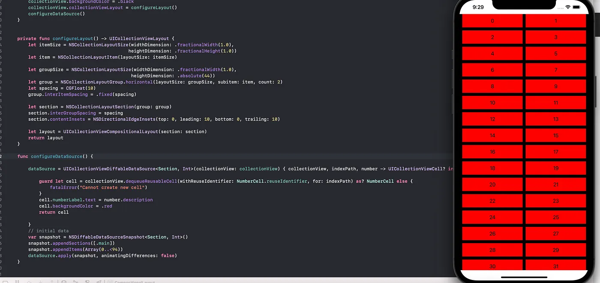

​																										图13

```swift
    func configLayout() -> UICollectionViewLayout {
        let itemSize = NSCollectionLayoutSize(widthDimension: .fractionalWidth(1.0), heightDimension: .fractionalHeight(1.0))
        let item = NSCollectionLayoutItem(layoutSize: itemSize)
        
        let groupSize = NSCollectionLayoutSize(widthDimension: .fractionalWidth(1.0), heightDimension: .absolute(44))
        let group = NSCollectionLayoutGroup.horizontal(layoutSize: groupSize, subitem:item,count: 2)
        let spacing = CGFloat(10)
        group.interItemSpacing = .fixed(spacing)
        group.contentInsets = NSDirectionalEdgeInsets(top: 0, leading: 10, bottom: 0, trailing: 10)
        
        let section = NSCollectionLayoutSection(group: group)
        section.interGroupSpacing = spacing
        section.contentInsets = NSDirectionalEdgeInsets(top: 0, leading: 10, bottom: 20, trailing: 10)
        
        let layout = UICollectionViewCompositionalLayout(section: section)
        return layout
    }
```

注意：使用NSCollectionLayoutGroup，接受显式的count参数的方式布局，以上述代码为例，水平布局，就会按count数量和间距设置均分group占据空间，即均分屏幕宽度，不会按itemSize中NSCollectionLayoutDimension指定宽度


# 定制Compositional Layout

> 完整示例见代码-[CompositionalLayout2](https://github.com/kingnight/UICollectionCompositionalLayout/)

首先，定制Model与Cell，后续使用

```swift
class TopApp:UICollectionViewCell{
    @IBOutlet weak var title: UILabel!
    @IBOutlet weak var subTitle: UILabel!
    @IBOutlet weak var appImageView: UIImageView!
    static let reuseIdentifier = "TopApp"
    override class func awakeFromNib() {
        super.awakeFromNib()
    }
}

struct TopAppModel:Hashable {
    let imageNamed:String
    let title:String
    let subTitle:String
    let identifier = UUID().uuidString
    
    static var mock:[TopAppModel]{
        return [
            TopAppModel(imageNamed: "externaldrive.connected.to.line.below", title: "facebook title", subTitle: "facebook subtitle"),
            TopAppModel(imageNamed: "personalhotspot.circle.fill", title: "instagram title", subTitle: "instagram subtitle"),
            TopAppModel(imageNamed: "bolt.horizontal.fill", title: "linkedin title", subTitle: "linkedin subtitle")
            
        ]
    }
}
```

## 每个Section不同布局

- 之前我们针对所有section使用相同的布局，即使用  `UICollectionViewCompositionalLayout(section: section)`创建，现在我们将创建每个section使用不同的布局

- 当使用UICollectionDataSource协议时，您可以使用IndexPath根据您所在的Section自定义单元格大小或Section行为，我们可以在这里定义布局时，也可以相似的根据Section的位置不同处理；

- 创建不同的布局layout（UICollectionViewCompositionalLayout），可以使用sectionprovider（UICollectionViewCompositionalLayoutSectionProvider）来创建一个组合布局(UICollectionViewCompositionalLayout)，它有多个具有不同布局的section。section提供程序跟踪它当前创建的section的索引，因此你可以不同地配置每个section。

  ```swift
  typealias UICollectionViewCompositionalLayoutSectionProvider = (Int, NSCollectionLayoutEnvironment) -> NSCollectionLayoutSection?
  ```

- 我们定义了一个接受closure的常量section提供程序，传递给这个闭包的参数是section索引，以及布局环境(该对象包含设置collection视图时关于布局环境的信息，trait collection之类的属性和关于布局容器的内容大小等信息)，您也可以基于此运行时信息自定义section布局(见下面UICollectionViewCompositionalLayout定义)，闭包返回NSCollectionLayoutSection类的实例这是你需要构建的
```swift
@available(iOS 13.0, *)
@MainActor open class UICollectionViewCompositionalLayout : UICollectionViewLayout {

    public init(section: NSCollectionLayoutSection)

    public init(section: NSCollectionLayoutSection, configuration: UICollectionViewCompositionalLayoutConfiguration)

    
    public init(sectionProvider: @escaping UICollectionViewCompositionalLayoutSectionProvider)

    public init(sectionProvider: @escaping UICollectionViewCompositionalLayoutSectionProvider, configuration: UICollectionViewCompositionalLayoutConfiguration)

    
    // Setting this property will invalidate the layout immediately to affect any changes
    //    Note: any changes made to properties directly will have no effect.
    @NSCopying open var configuration: UICollectionViewCompositionalLayoutConfiguration
}

public typealias UICollectionViewCompositionalLayoutSectionProvider = (Int, NSCollectionLayoutEnvironment) -> NSCollectionLayoutSection?
```


- 因为我们有不同的布局，我们创建了UICollectionViewCompositionalLayout实例与sectionprovider构造函数，注意section provider是转义闭包，所以要检查内存泄漏的问题
- layout（UICollectionViewCompositionalLayout）- sectionprovider（UICollectionViewCompositionalLayoutSectionProvider）- section（NSCollectionLayoutSection）

```swift
func createTopAppLayout() -> NSCollectionLayoutSection {
        let itemSize = NSCollectionLayoutSize(widthDimension: .fractionalWidth(1.0), heightDimension: .fractionalHeight(1.0))
        let item = NSCollectionLayoutItem(layoutSize: itemSize)
        
        let groupSize = NSCollectionLayoutSize(widthDimension: .fractionalWidth(1.0), heightDimension: .absolute(74))
        let group = NSCollectionLayoutGroup.horizontal(layoutSize: groupSize, subitems: [item])
        
        let section = NSCollectionLayoutSection(group: group)
        section.interGroupSpacing = 10
        section.contentInsets = NSDirectionalEdgeInsets(top: 10, leading: 0, bottom: 0, trailing: 0)
        return section
    }
    
 func createFeatureCellLayout() -> NSCollectionLayoutSection {
        let itemSize = NSCollectionLayoutSize(widthDimension: .fractionalWidth(0.48), heightDimension: .fractionalHeight(1.0))
        let item = NSCollectionLayoutItem(layoutSize: itemSize)
        
        let groupSize = NSCollectionLayoutSize(widthDimension: .fractionalWidth(1.0), heightDimension: .absolute(300))
        let group = NSCollectionLayoutGroup.horizontal(layoutSize: groupSize, subitems: [item])
        group.interItemSpacing = .flexible(10)
        
        let section = NSCollectionLayoutSection(group: group)
        section.interGroupSpacing = 10
        section.contentInsets = NSDirectionalEdgeInsets(top: 10, leading: 10, bottom: 10, trailing: 10)
        return section
    }
 
func configLayout2() -> UICollectionViewLayout {
        let layout = UICollectionViewCompositionalLayout { [weak self] sectionIndex, layoutEnvironment in
            if sectionIndex == 0 {
                return self?.createTopAppLayout()
            }
            else if sectionIndex == 1{
                return self?.createFeatureCellLayout()
            }
            else{
                return self?.createNestedGroupLayout()
            }
        }
        return layout
 }
```

如图所示结果

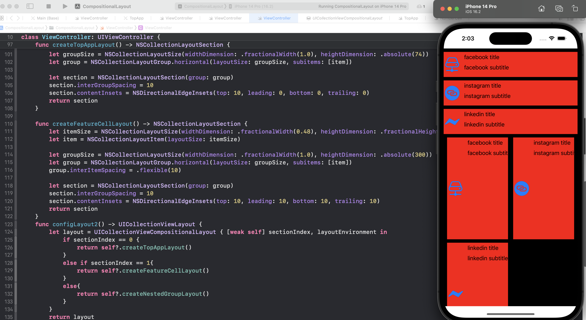

​																										图14

## 嵌套布局组 Nested Layout Group

compositional layout的核心就是布局，layoutgroup实际上是NSCollectionLayoutItem的一个子类型`class NSCollectionLayoutGroup : NSCollectionLayoutItem`，因为这个关系，当你指定布局组中的Item时，你可以嵌套Group。这种特殊的嵌套没有限制，是任意的。因为我们有了这个，它开启了许多有趣的新设计。

在下面这个例子中，group由三个item组成，在左侧有一个大Item，右侧有一个垂直Group，包含两个子Item。

- 首先，我们创建一个左侧的大Item，它将占其父元素的70%宽度，它将占其父元素的100%高度
- 我们为trailingItem创建布局数据，它将占用其父元素宽度的100%和其父元素高度的30%
- 第三，我们创建了右侧垂直方向的Group，并添加了我们在步骤2中创建的两个Item，它将占用父元素宽度的30%，并占用父元素高度的100%
- 最后，我们创建了水平的nestedGroup，并添加了左侧和右侧组。nestedGroup将占用其父布局的100%宽度，即section宽度，section宽度最终将占用主布局的宽度，即整个屏幕宽度
- nestedGroup将获取其父元素的100%高度，即section的宽度，并最终获取主布局的高度，即整个屏幕的高度
- 注意右侧组有两个元素，对于子元素，它充当父元素，因此每个子元素将占用父元素的100%宽度，它的屏幕宽度为0.3。

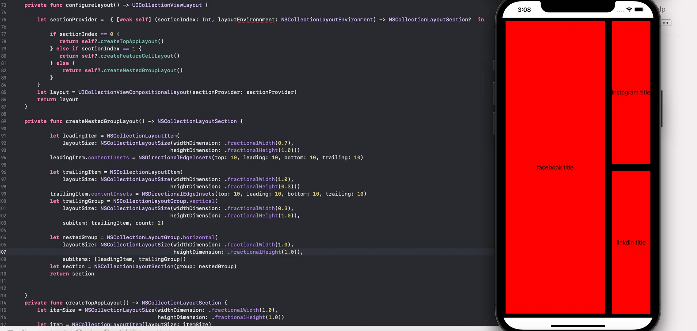

​																								图15

>完整示例见代码-[CompositionalLayout2](https://github.com/kingnight/UICollectionCompositionalLayout/) createNestedGroupLayout

## 嵌套CollectionView

>完整示例见代码-[CompositionalLayout3](https://github.com/kingnight/UICollectionCompositionalLayout/) 

这一节，重点介绍section.orthogonalScrollingBehavior属性；orthogonalScrollingBehavior 的出现，解决一个很复杂的问题，再也不用在 cell 里面放一个 CollectionView、或是转 90 度的 TableView；这个orthogonalScrollingBehavior 一旦被设定， CollectionView 的section 会变成一个特别的横向scroll view，我们完全不用去考虑这个多出来的scroll view，cell和datasource仍然按前面方式正常设置，数据和展示完全分离，可以说是非常方便！


如图16所示，我们创建的布局中item将占据整个屏幕，宽度和高度是恒定的或绝对的，其中重要的一点是orthogonalScrollingBehavior = .continuous；orthogonalScrollingBehavior:相对于主布局轴的部分滚动行为。

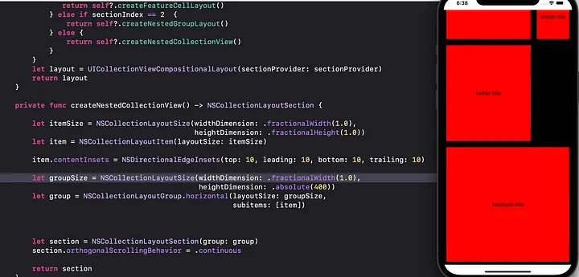

​																					图16 - 实现水平滚动效果

在图17中可以看到，我们注释掉了orthogonalScrollingBehavior，因此它使用默认值none→该部分不允许用户正交滚动其内容。所以它垂直地添加item

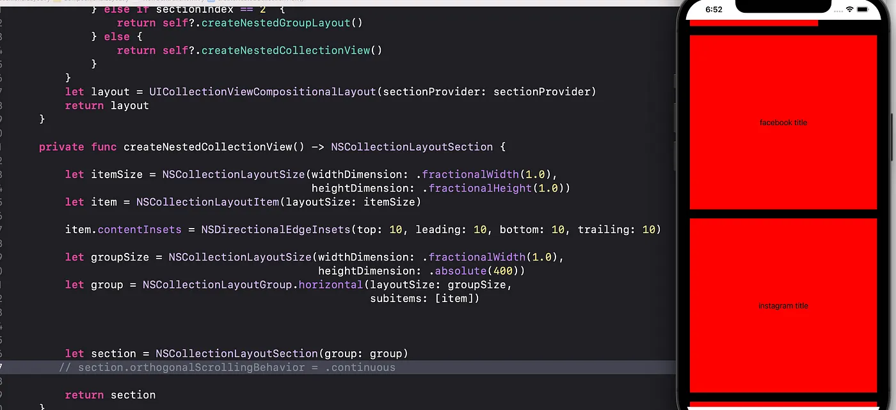

​													图17- 注释掉了orthogonalScrollingBehavior垂直地添加item

section.orthogonalScrollingBehavior = .paging 我们使用分页作为orthogonalScrollingBehavior的值，它会进行一项一项的滚动。


如图18所示，我们创建了三个Item的嵌套组，并创建了白色矩形来指定每个组，因此通过使用。grouppaging，当您滚动时，您将看到另一个组，简而言之，总是滚动停止时，组开始

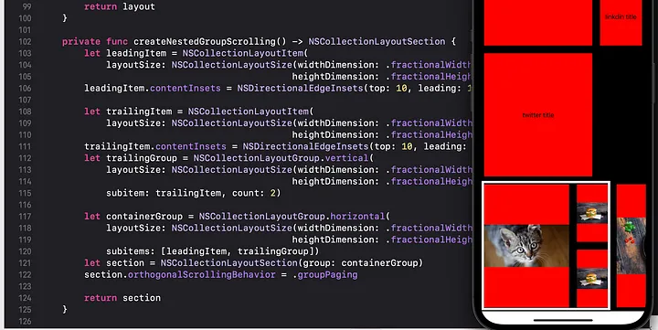

图18

通过使用.grouppagingcentered，当你滚动时，它将进行组分页，并将组放在屏幕的中心

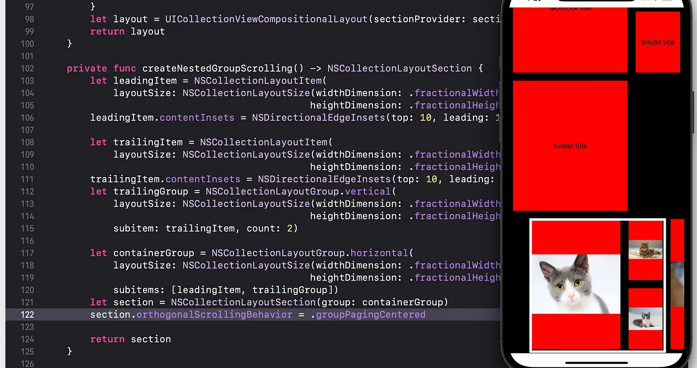

图19

section.orthogonalScrollingBehavior所有属性：

- continuousGroupLeadingBoundary→该部分允许用户正交滚动其内容，在可见组的前边自然停止。
- continuous→该区域允许用户在连续滚动时垂直滚动内容
- none→该区域不允许用户垂直滚动其内容。
- paging→允许用户正交地对其内容分页。
- groupPaging→该节允许用户一次对一个组的内容进行正交分页。
- groupPagingCentered→该部分允许用户一次对一个组的内容进行正交分页，使每个组居中。

## 自定义布局 Custom Layout

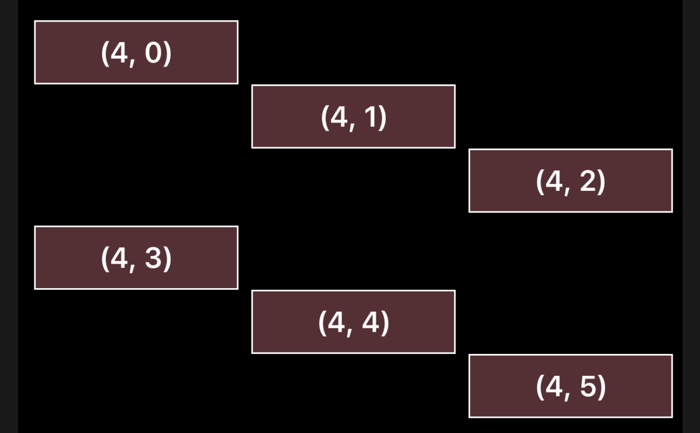

图20

前面我们有介绍，Group是组合布局的基本单位。有三种形式：水平，垂直和自定义布局，现在就来介绍如何自定义布局；

我们将要尝试的布局样式如图20所示，类似楼梯台阶不断向下延伸的效果的 layout，我們可以來看看怎樣做出完全定制的 group layout，也就是如何利用 `NSCollectionLayoutGroup` 的 `.custom` 這個 builder method：

```swift
let height: CGFloat = 120.0
let groupLayoutSize = NSCollectionLayoutSize(widthDimension: .fractionalWidth(1), heightDimension: .absolute(height))
let group = NSCollectionLayoutGroup.custom(layoutSize: groupLayoutSize) { (env) -> [NSCollectionLayoutGroupCustomItem] in
    let size = env.container.contentSize
    let spacing: CGFloat = 8.0
    let itemWidth = (size.width-spacing*4)/3.0
    return [
        NSCollectionLayoutGroupCustomItem(frame: CGRect(x: 0, y: 0, width: itemWidth, height: height/3.0)),
        NSCollectionLayoutGroupCustomItem(frame: CGRect(x: (itemWidth+spacing), y: height/3.0, width: itemWidth, height: height/3.0)),
        NSCollectionLayoutGroupCustomItem(frame: CGRect(x: ((itemWidth+spacing)*2), y: height*2/3.0, width: itemWidth, height: height/3.0))
    ]
}
```

这个地方看起来有点复杂，让我们先从 `.custom` 的定义开始看起：：

```swift
open class func custom(layoutSize: NSCollectionLayoutSize, itemProvider: @escaping NSCollectionLayoutGroupCustomItemProvider)
```

这里的 `.custom` 是指明我们这个 group 里面的 layout 要我们自己来决定，它的第一个参数 **layoutSize** 指定这个 group 的大小。第二个参数 **itemProvider** ，是一个 `(NSCollectionLayoutEnvironment) -> [NSCollectionLayoutGroupCustomItem]` 的 closure，在系统准备呈现 **item** 之前，会调用这个 closure，请 closure 提供每一个 **item** 的位置信息。这个closure 会传入一个代表Item的`NSCollectionLayoutEnvironment` 进来，然后我们就可以利用这个environment 提供的信息，来计算**item** 的大小跟位置，并且在closure 把算好的**item**大小跟位置，透过类型是`NSCollectionLayoutGroupCustomItem` 的类型传出来，回传值是一个array，代表的是你需要指明这个group 总共会有几个**item**。所以你会看到上面我们透过 `env.container.contentSize` 拿到容器的大小，也就是 **group** 的大小。利用这个信息，算出这个**group** 里面的三个Item的绝对位置，再用`NSCollectionLayoutGroupCustomItem` 封装位置信息传回去；而拿到这些信息的`NSCollectionLayoutGroup`，就可以知道在这个**group 里面要怎样呈现这些**item 了。

## 测试

下面读者你可以自己尝试实现一个类似 AppStore 的 页面布局，但是每一個Item高度不同，具体参数图21都已经指明

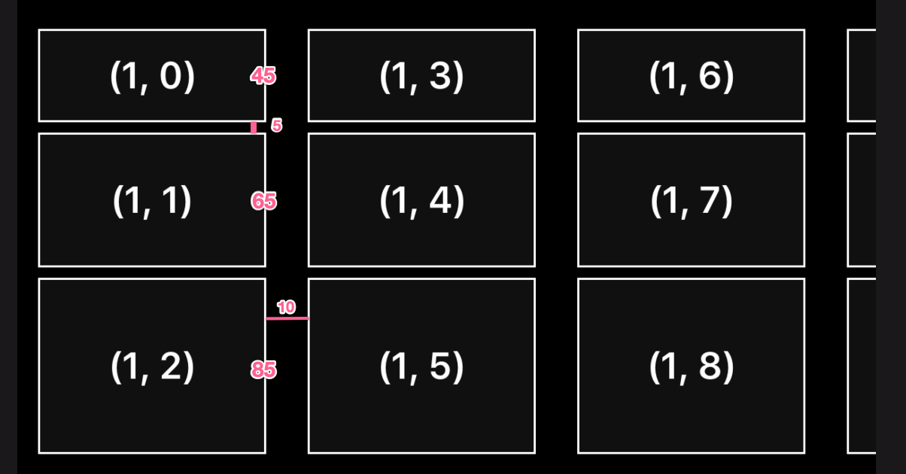

图21


如果你已经思考过了

.........

请看答案


```swift
// 提供三種不同形狀的 item 
let layoutSize = NSCollectionLayoutSize(widthDimension: .absolute(110), heightDimension: .absolute(45))
let item = NSCollectionLayoutItem(layoutSize: layoutSize)
let layoutSize2 = NSCollectionLayoutSize(widthDimension: .absolute(110), heightDimension: .absolute(65))
let item2 = NSCollectionLayoutItem(layoutSize: layoutSize2)
let layoutSize3 = NSCollectionLayoutSize(widthDimension: .absolute(110), heightDimension: .absolute(85))
let item3 = NSCollectionLayoutItem(layoutSize: layoutSize3)

// 給剛好大小的 group
let groupLayoutSize = NSCollectionLayoutSize(widthDimension: .absolute(110), heightDimension: .absolute(205))    //45+65+85 = 195

// 用 .vertical 指明我們的 group 是垂直排列的
let group = NSCollectionLayoutGroup.vertical(layoutSize: groupLayoutSize, subitems: [item, item2, item3])

// 這裡指的是垂直的間距了
group.interItemSpacing = .fixed(5)     //2 *5 = 10 

group.edgeSpacing = NSCollectionLayoutEdgeSpacing(leading: nil, top: nil, trailing: .fixed(10), bottom: nil)

let section = NSCollectionLayoutSection(group: group)
section.orthogonalScrollingBehavior = .continuousGroupLeadingBoundary
let layout = UICollectionViewCompositionalLayout(section: section)
return layout
```

我们利用 group.edgeSpacing 来设定 group 的边界距离。这个edgeSpacing 是一个型别为NSCollectionLayoutEdgeSpacing 的property，它的initializer函数： `init(leading: NSCollectionLayoutSpacing?, top: NSCollectionLayoutSpacing?, trailing: NSCollectionLayoutSpacing?, bottom: NSCollectionLayoutSpacing?)`，利用这个，我们可以描述一个group的上下左右的边界距离。


# 辅助视图Supplementary view 

> 完整示例见代码-[CompositionalLayout4](https://github.com/kingnight/UICollectionCompositionalLayout/) 

* CollectionView管理着三个基本的视图类:cell,supplementary items , decoration items。

* Supplementary view的常见用途，三个方面：Badge，页眉和页脚。页眉和页脚支持固定或随内容滚动。

* 新类型，NSCollectionLayoutAnchor。

## 创建Badge

### 右上角外移
- 首先，我们为badge定义一个`NSCollectionLayoutAnchor`。通过指定`[.top,.trailing]`。我们将badge定位在父元素的右上角，而使用`fractionalOffset`将badge的中心定位在角落。`fractionalOffset`为`.zero`会将整个标记定位到父标记中。参见https://developer.apple.com/documentation/uikit/nscollectionlayoutanchor
-  如前所述，我们需要为Item创建一个尺寸，因此这里指定badge的宽度和高度为固定值
- 我们初始化了NSCollectionLayoutSupplementaryItem，给它指定了大小、锚点和一个elementKind，根据它在`collectionView:viewForSupplementaryElementOfKind:atIndexPath:`中标识。
- 现在我们已经准备好了Badge，我们只需要将它分配给我们的项目。要做到这一点，只需替换NSCollectionLayoutItem初始化器，并添加supplementaryItems和传递的badge

这里我们看到我们马上创建了NSCollectionLayoutAnchor。我们指定edge。我们希望这个badge被固定在该特定单元格的顶部尾部。我们想让它跳出几何图形，向外突出极小的高度，它们并不在Cell本身的几何结构中。这个`fractionalOffset`偏移让我们有能力往外移。

在X轴正方向处移动30%在负Y处也移动30%，然后我们用badgeSize和elementKind定义了CollectionLayout的SupplementaryItem。引用CollectionView的视图类用那个注册的Supplementary view类型 。然后指定容器的锚点，指定它将如何关联。现在我们有了supplementary的定义，我们需要把它和某个东西联系起来。它需要与一个元素，一个单元格相关联。在这个例子中我们会用一个扩展的初始化方法来初始化它，它接受一个supplementary的数组。

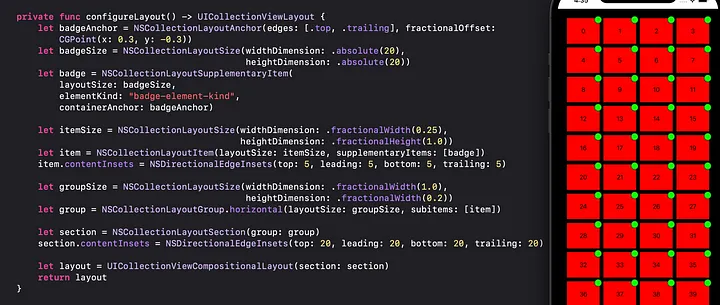

​																											图23

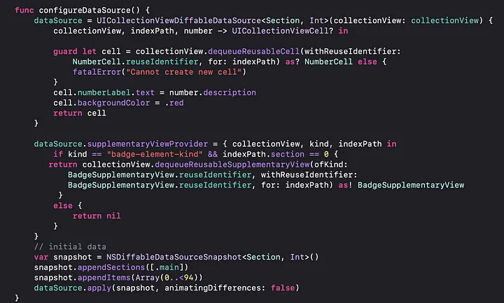

​																											图24

### 左上角内顶点
如图25所示，我们将badge移动到top leading位置，并且fractionalOffset是item的偏移量，指定0，它将badge锚定在item内。

如果我们想告诉Compositional Layout我们想要supplementary views，我们需要将它们关联到NSCollectionLayoutItem或NSCollectionLayoutGroup。这可以通过init或稍后的supplementaryItems属性来实现。这两种情况都需要一个NSCollectionLayoutSupplementaryItem类型的数组。这个类允许我们定义supplementary items。**你不能在section上添加NSCollectionLayoutSupplementaryItem Item。对于section，NSCollectionLayoutBoundarySupplementaryItem，我们将在下一节中看到。**

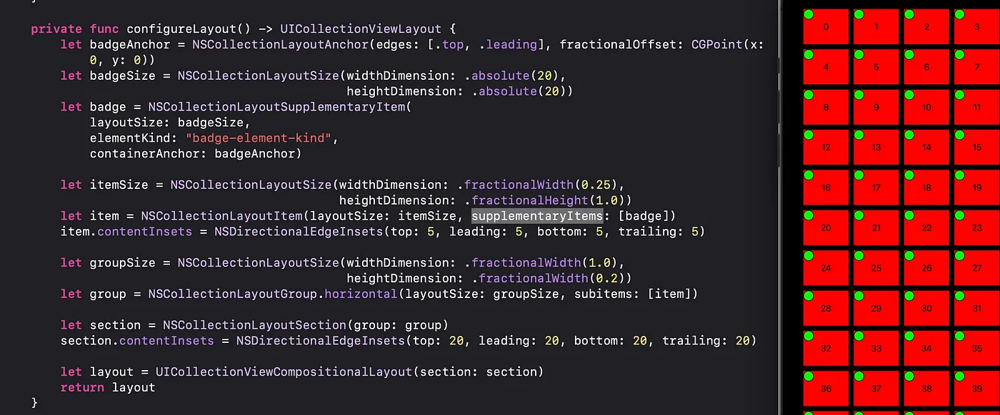

图25

###  NSCollectionLayoutAnchor
NSCollectionLayoutAnchor→定义如何将supplementary item附加到集合视图中的Item上的对象。可以使用锚点将supplementary item附加到特定Item。锚点包含有关supplementary item在item上的位置的信息，包括:

* edge:边缘或一组边缘通过指定两条相邻的边，可以将supplementary item附加到单个边或拐角上。
* Item的偏移量。默认情况下，supplementary item被锚定在它所附加的Item的指定边缘内。可以通过在创建锚点时提供自定义偏移量来更改此位置。

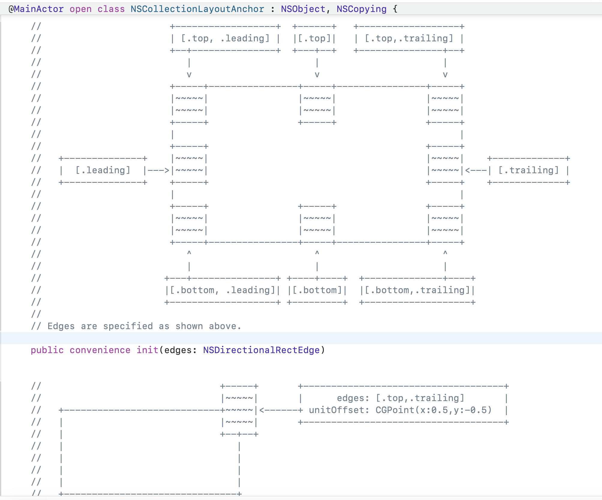

图26

Badge用户界面代码

```swift
class BadgeSupplementaryView: UICollectionReusableView {
    static let reuseIdentifer = "BadgeSupplementaryView"
        
    override init(frame: CGRect) {
        super.init(frame: frame)
        self.backgroundColor = .green
        self.clipsToBounds = true
        self.layer.cornerRadius = 10
    }
    
    required init?(coder: NSCoder) {
        fatalError("init(coder:) has not been implemented")
    }
}
```

## 页眉&页脚

首先定义一些元素类型
```swift
struct ElementKind {
    static let badge = "badge-element-kind"
    static let background = "background-element-kind"
    static let sectionHeader = "section-header-element-kind"
    static let sectionFooter = "section-footer-element-kind"
    static let layoutHeader = "layout-header-element-kind"
    static let layoutFooter = "layout-footer-element-kind"
}
```
如图27所示，我们做了一些事情

1. 创建一个badge，将其锚定到单元格Item上
2. 然后创建一个group，将item分配给一个group
3. 最后，我们创建sectionHeader `NSCollectionLayoutBoundarySupplementaryItem`（特别注意跟badge区别），给它布局headerFooterSize，并给头部对齐作为顶部和底部。注意headerFooterSize是动态的，这意味着它会随着内容的增加而增长，这是因为我们提供的是估计高度而不是绝对高度
4. 然后我们提供boundarySupplementaryItems并传递页眉和页脚给section

NSCollectionLayoutBoundarySupplementaryItem→与部分边界边相关的supplementary items的数组，例如页眉和页脚。

NSCollectionLayoutSupplementaryItem→一个对象，用于添加页眉或页脚的集合视图。边界supplementary item是supplementary item的特殊类型(NSCollectionLayoutSupplementaryItem)。可以使用边界supplementary item向集合视图的某个部分或整个集合视图添加页眉或页脚。**每种类型的supplementary item项必须具有唯一的元素类型。考虑以一种可以直接识别每个元素的方式一起跟踪这些字符串。**


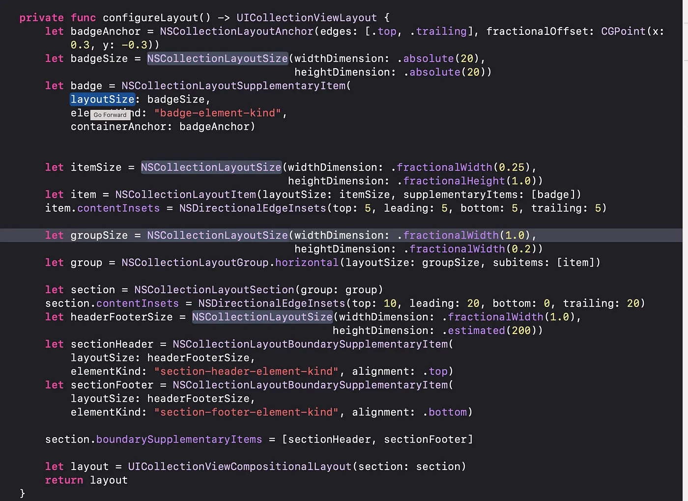

图27

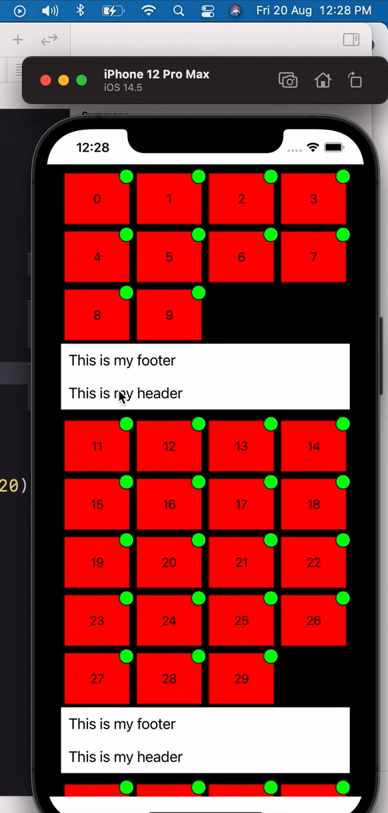

gif 动画

如图28所示，Diffable数据源有一个supplementaryViewProvider属性，我们可以用它来提供supplementary views。这可以是一个闭包，也可以定义一个方法，该方法接受collectionview、kind和indexPath，并分配这个方法。

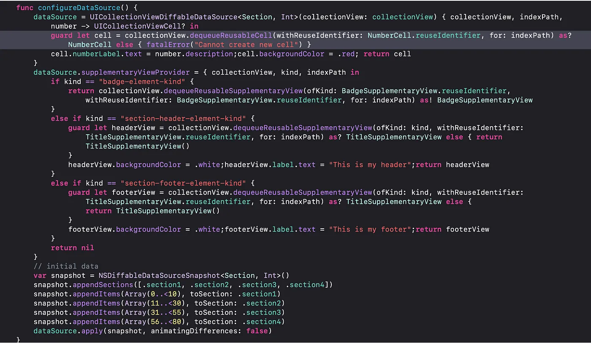

图28

注册supplementary view非常重要，否则应用程序会崩溃

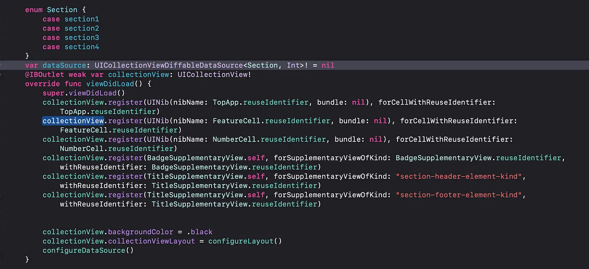

图29

###  固定header和footer

如图30所示，我们固定了header和footer

pinToVisibleBounds→布尔值，表示页眉或页脚是固定在它所附加的部分或布局的顶部或底部可见边界上。这个属性的默认值为false，表示边界补充项(页眉或页脚)在滚动期间保持在原来的位置，并在其部分或布局滚动时移动到屏幕外。将该属性的值设置为true，以将边界补充项固定在它所附加的部分或布局的可见边界上。这样，在显示边界supplementary view时，它所附加的部分或布局的任何部分都是可见的。

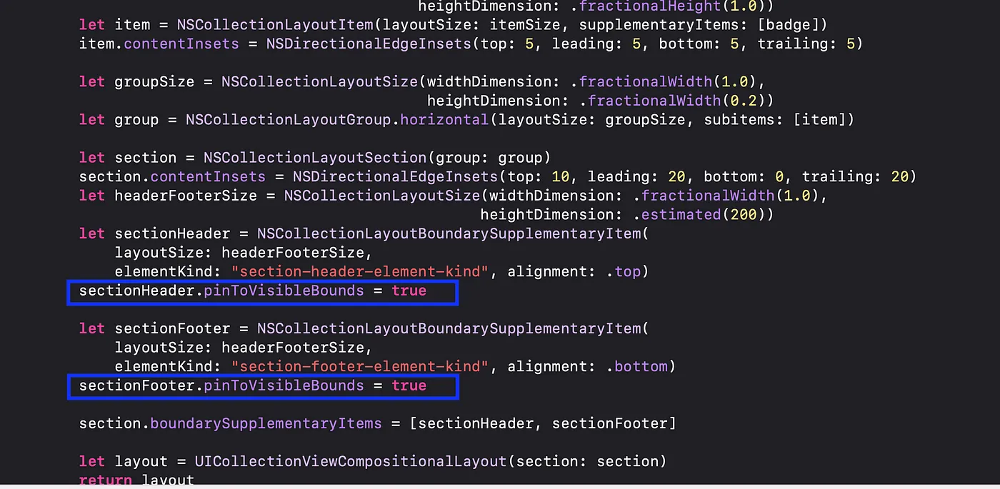

图30

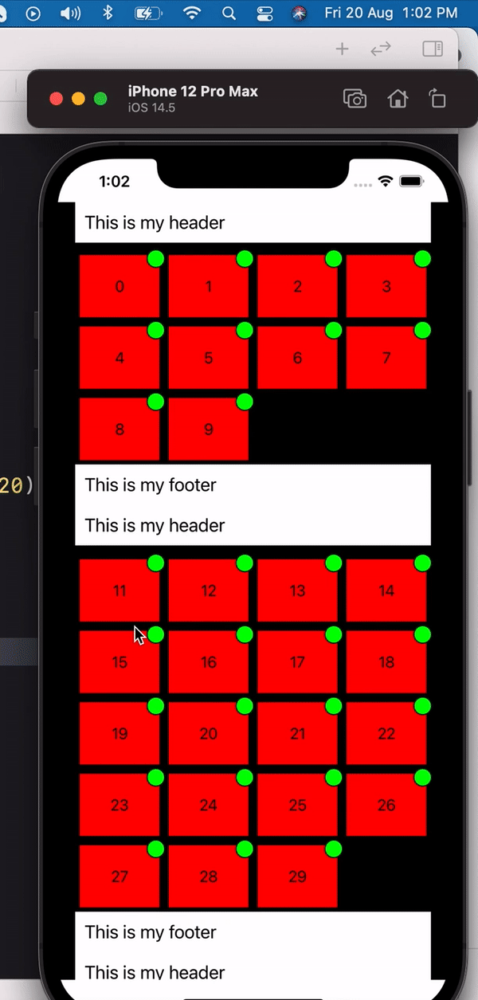

gif 动画

### zindex

zindex→补充项相对于该段内其他项的垂直堆叠顺序。这个属性用于在布局过程中确定元素从前到后的顺序。具有较高索引值的项目出现在具有较低索引值的项目的顶部。具有相同值的元素具有不确定的顺序。

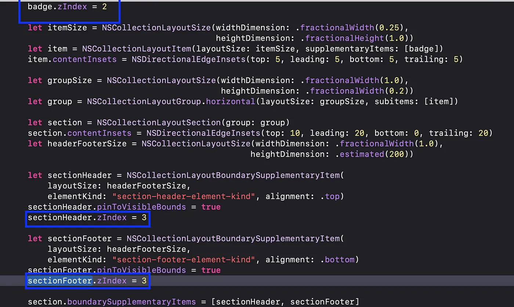

图31

## 多个Badge同时展示

现在我们在每个项目中添加了两个badge，注意每个supplementary item都应该有唯一的elementKind，还有一件事elementKind可以是任何字符串。

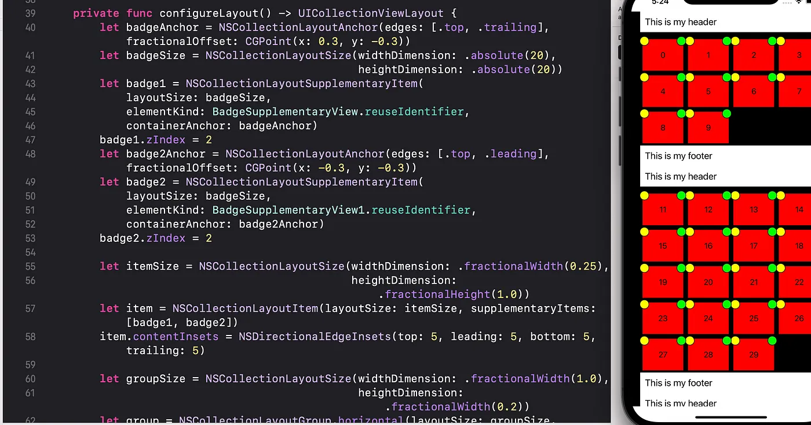

图32

DataSource

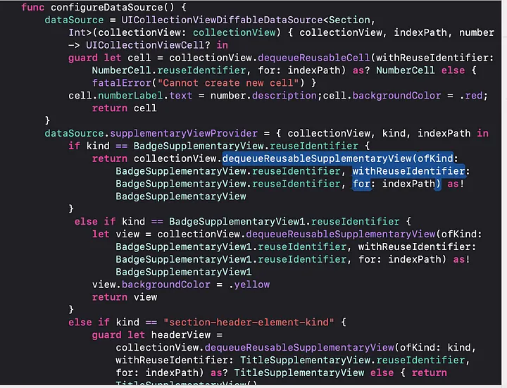

图33

注册 supplementary View

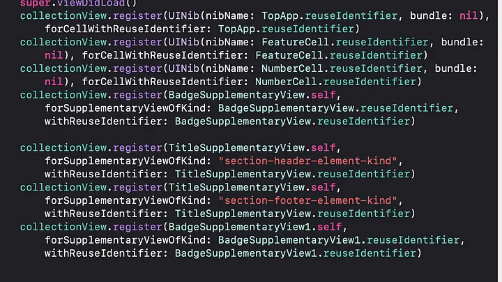

图35

## Decoration Items

> 完整示例见代码-[CompositionalLayout5](https://github.com/kingnight/UICollectionCompositionalLayout/) 

除了supplementary items之外，我们还可以使用装饰项Decoration Items自定义section布局。这将允许我们轻松地**为section添加背景**。我们要创建的背景视图非常简单(一个带圆角半径的灰色矩形)，所以用代码来完成

```swift
class BackgroundSupplementaryView: UICollectionReusableView {
    override init(frame: CGRect) {
        super.init(frame: frame)
        layer.cornerRadius = 8
        backgroundColor = UIColor(white: 0.85, alpha: 1)
    }
    
    required init?(coder: NSCoder) {
        fatalError("init(coder:) has not been implemented")
    }
    
}
```

我们用`CollectionLayoutDecorationItem`来支持它。你只需要用 `element kind`创建它，就可以了。这是用来在section内容背后建立一个视图给你漂亮的视觉分组。要构建它，只需要一行代码。然后将它添加到section中，你只需要指定Item就可以了

如图36所示，我们为背景视图创建了布局，它将为每个部分显示，我们使用布局进行注册`layout.register(BackgroundSupplementaryView.self, forDecorationViewOfKind: “background”)`,注册一个类，用于为集合视图创建装饰视图。这个方法让布局对象有机会注册一个装饰视图，在集合视图中使用。**装饰视图为部分或整个集合视图提供可视化的装饰，但不与集合视图的数据源提供的数据绑定。你不需要显式地创建装饰视图。** 注册一个后，由layout对象决定何时需要一个装饰视图，并从它的`layoutAttributesForElements(in:)`方法返回相应的布局属性。对于指定装饰视图的布局属性，集合视图创建(或重用)一个视图，并根据注册的信息自动显示它。

如果您以前使用相同的类型字符串注册了类或nib文件，则您在viewClass参数中指定的类将替换旧条目。如果你想注销装饰视图，可以为viewClass指定nil。

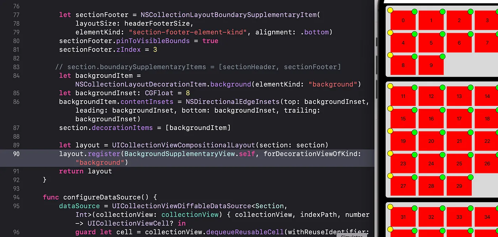

图36

## 全局 Header , Footer 和 Decorative View

如图37所示，我们在布局中全局添加了header和footer，而不是section，因为section和footer的pinToVisibleBounds是true，所以它将在屏幕上可见

`UICollectionViewCompositionalLayoutConfiguration`→定义滚动方向、区域间距和布局的页眉或页脚的对象。你可以使用布局配置来修改集合视图布局的默认滚动方向，在布局的每个部分之间添加额外的间距，并为整个布局添加页眉或页脚。你可以在创建`UICollectionViewCompositionalLayout`时传入这个配置，或者你可以在现有的布局上设置configuration属性。如果在现有布局上修改配置，系统会使布局失效，以便用新的配置更新它。

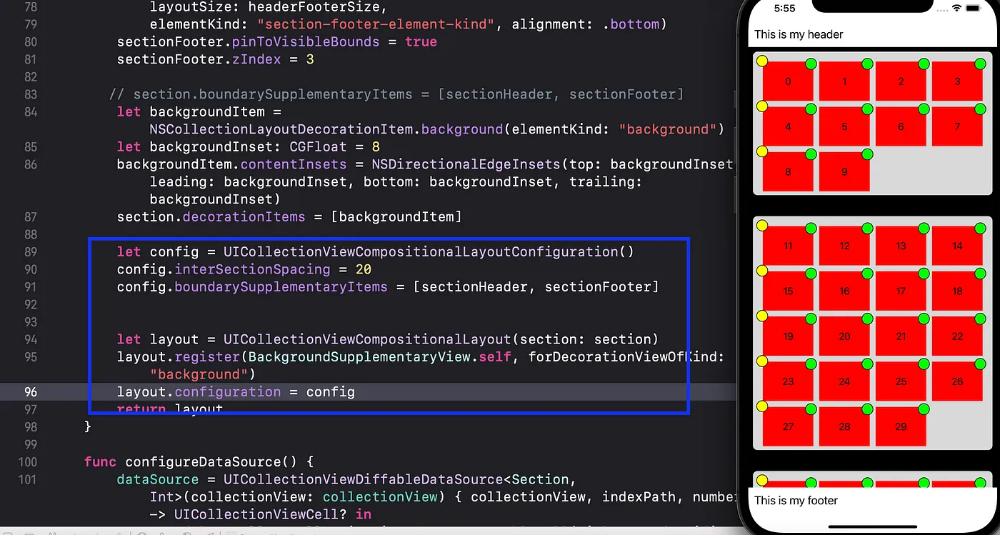

图37

如图38所示，现在注释pinToVisibleBounds，当滚动全局header和footer时，也会滚动

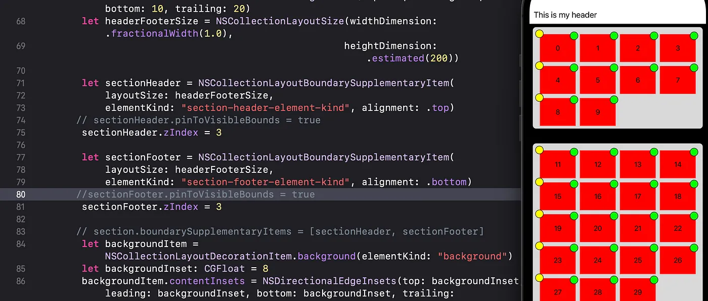

图38

# 滚动行为与滚动方向

最后一节，我们看看UICollectionViewCompositionalLayoutConfiguration这个配置中的scrollDirection属性，其默认值是UICollectionViewScrollDirectionVertical，即垂直滚动，这个属性与前面提到的section.orthogonalScrollingBehavior组合使用，会产生奇妙的效果

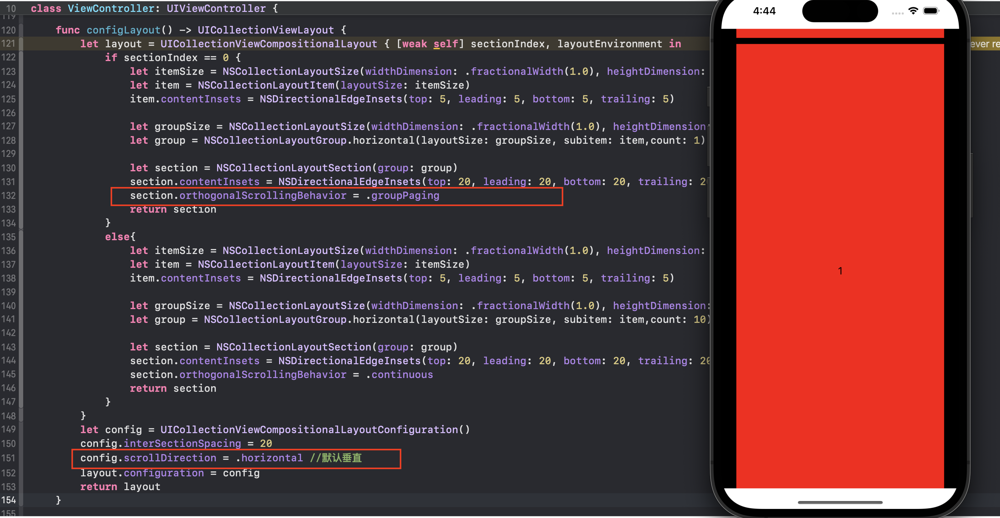

图39

当scrollDirection属性设置水平，orthogonalScrollingBehavior设置非none属性，都会使得滚动轴方向调转，从水平变成垂直，垂直滚动，每个Item占满整个屏幕，每个Item自动分页效果展示。

# 结语

通过学习本文,我们全面了解了UICollectionViewCompositionalLayout的强大功能。它通过Item、Group和Section的分层结构,为构建复杂的自定义布局提供了巨大的灵活性。我们还学习了各种高级布局技巧,如嵌套布局组、装饰视图、全局头尾等。Compositional Layout使我们可以用声明式代码优雅地表达布局意图。它是在iOS上构建复杂滚动UI的未来方向。希望本文能让您对Compositional Layout有更深的理解,并在项目中大胆运用它。掌握它,我们就能创造出更加惊人的用户体验!